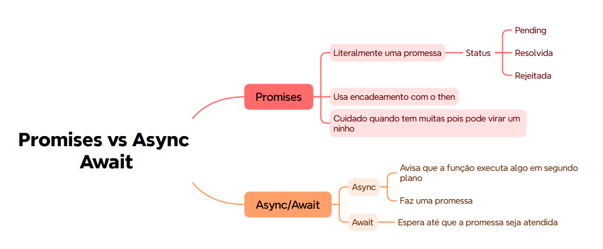

# Aula: Promises vs Async/Await com Selenium

Este repositório reúne exemplos usados em aula para comparar duas formas comuns de lidar com operações assíncronas em JavaScript:

- Promise com encadeamento de `then()` e `catch()`
- `async/await` para escrever o mesmo fluxo de forma mais linear

O foco prático é um teste automatizado de login no Sauce Demo usando Selenium WebDriver e Mocha.



## O que tem aqui

- `test/login.promise.spec.js` mostra o teste com encadeamento de Promise.
- `test/login.promise2.spec.js` traz uma variação adicional do mesmo tema.
- `test/login.async.spec.js` mostra o teste com `async/await`.
- `test/dto/user-dto.js` guarda o DTO usado no teste com `async/await`.

## Conceitos abordados

- Uma Promise representa uma operação assíncrona que pode ficar `pending`, `resolved` ou `rejected`.
- `then()` encadeia passos quando a Promise é resolvida.
- `async/await` deixa o fluxo assíncrono mais próximo da leitura de código síncrono.
- Em testes, `await` costuma deixar o passo a passo mais fácil de acompanhar.

## O que os testes fazem

Os testes acessam https://www.saucedemo.com/, preenchem usuário e senha e validam se a página principal aparece após o login.

Credenciais usadas no exemplo:

- usuário: `standard_user`
- senha: `secret_sauce`

## Pré-requisitos

- Node.js 18+ instalado
- Navegador Chrome ou Edge disponível para o Selenium Manager

## Instalação

```bash
npm install
```

## Execução

```bash
npm run promise
npm run async
npm test
```

## Scripts disponíveis

- `npm run promise` executa `test/login.promise.spec.js`
- `npm run async` executa `test/login.async.spec.js`
- `npm test` executa todos os testes em `test/**/*.spec.js`

## Observação

O arquivo `test/login.promise2.spec.js` está mantido como variação de estudo do mesmo conteúdo, então o comando `npm test` o inclui junto com os outros testes.